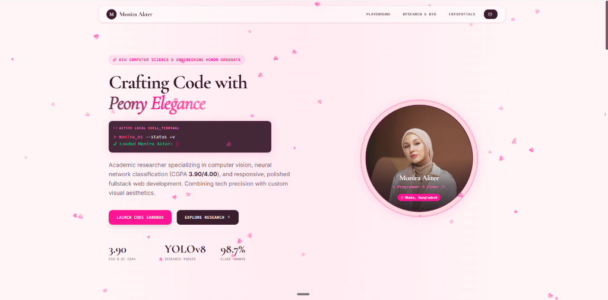

<div align="center">
  
</div>

# 🌸 Monira Akter - Portfolio & Research Sandbox

Welcome to the official repository of **Monira Akter's Academic Portfolio and Interactive Development Sandbox**. This project combines technical computer science credentials, AI research highlights, and live, interactive web widgets under a custom **Peony Pink & Dark Currant** design system.

---

## 🚀 Key Interactive Features

The portfolio is designed as an interactive sandbox playground, enabling visitors to verify competencies, run simulated code, and play custom-coded strategy games.

### 1. 💻 Live Code IDE Sandbox (`LiveTerminal.tsx`)
*   **Virtual IDE Shell**: A mock development environment that lets users browse and edit code presets (`monira.ts`, `classification.py`, `portfolio.json`).
*   **Simulated Cloud Compiler**: Run script executions and witness real-time compile logging outputs directly inside the browser.
*   **Quick Execution Triggers**: Built-in hotkeys to execute sample tasks such as fetching API statistics or running image pipeline mocks.

### 2. 🔬 Guava Disease AI Modeler & Segmentation (`GuavaClassifier.tsx`)
*   **Thesis Demonstration**: An interactive agricultural computer vision sandbox modeled after Monira's undergrad capstone research thesis.
*   **Neural Scanning Simulation**: Scan leaf specimens (`Healthy Leaf`, `Guava Rust`, `Algal Leaf Spot`) with a modern bounding box mesh overlay.
*   **Remediation Diagnostics**: Displays machine learning confidence levels (up to 98.7% accuracy), condition analysis, and crop remediation advisories for farmers.

### 3. 🎲 Three Men Morris Game (`ThreeMenMorris.tsx`)
*   **Interactive Classic Game**: A fully playable web version of the classic strategic board game *Three Men Morris*.
*   **Game State Algorithms**: Features clean computational rules, position tracking, movement validations, and responsive win-condition checks.

### 4. 📈 Academic Trajectory & Credentials
*   **Interactive Timeline**: Browse degrees, coursework foundations, mathematical competencies, and research capstones at Dhaka International University (B.Sc. in CSE, CGPA: **3.90/4.00**).
*   **Skill Spectrum**: Interactive categorization of programming languages, frontend utilities, databases, and machine learning architectures (TensorFlow, YOLOv8, OpenCV).
*   **Validated Testimonials**: Reviews and commendations from thesis supervisors and industry leaders.

---

## 🎨 Visual & Technical Design System

*   **Aesthetics**: Glassmorphism card templates, smooth gradients, custom neon glows, and micro-animations.
*   **Interactive Canvas**: A customized canvas-based background animation rendering floating peony flower petals (`FloatingPetals.tsx`).
*   **Color Palette**:
    *   `Blush Pink` (`#FFF5F6`) – Primary background
    *   `Currant Plum` (`#2C1319`) – Bold typography and dark headers
    *   `Peony Rose` (`#FF2E93`) – Energetic accent color and neon glow states
*   **Responsive layouts**: Fully optimized across desktop, tablet, and mobile screens.

---

## 🛠️ Technology Stack

*   **Core Framework**: [React 19](https://react.dev/) + [TypeScript](https://www.typescriptlang.org/)
*   **Build Utility**: [Vite](https://vite.dev/)
*   **Styling**: [Tailwind CSS](https://tailwindcss.com/)
*   **Icons**: [Lucide React](https://lucide.dev/)
*   **Animations**: Canvas API, Custom CSS Keyframes, Tailwind transitions

---

## 💻 Local Development Setup

### Prerequisites
*   [Node.js](https://nodejs.org/) (v18+)
*   npm or yarn package manager

### Installation Steps

1.  **Clone the Repository** and navigate to the project directory:
    ```bash
    cd monira-akter-portfolio
    ```

2.  **Install Dependencies**:
    ```bash
    npm install
    ```

3.  **Environment Configuration**:
    Copy the sample environment file to `.env.local` (or `.env`):
    ```bash
    cp .env.example .env.local
    ```
    *Open `.env.local` and configure your API keys if needed.*

4.  **Start the Local Development Server**:
    ```bash
    npm run dev
    ```
    The application will launch on `http://localhost:3000/`.

---

## 📄 License & Contact

*   **Developer**: Monira Akter
*   **Email**: monira2002akter@gmail.com
*   **Phone**: +8801890350902
*   **Address**: Dhaka, Bangladesh
*   **Source Code**: [GitHub Portfolio](https://github.com/monira2002)
